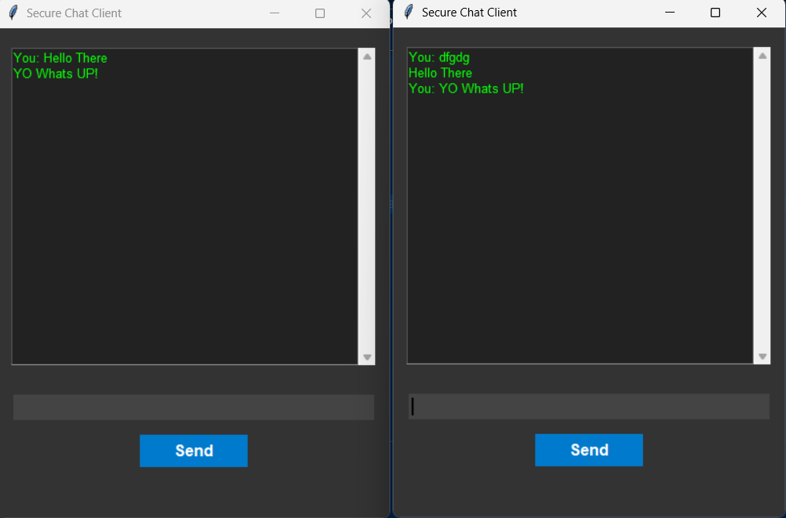

# Secure Chat Application

A simple yet secure chat application built using Python sockets, SSL encryption, and Tkinter for the graphical interface. This application allows multiple clients to connect to a server and communicate securely, with messages encrypted over SSL/TLS.

## Features

- **End-to-End Encryption**: Messages are securely encrypted using SSL/TLS, ensuring privacy.
- **Multi-Client Support**: Multiple clients can join and communicate in a single chat room.
- **GUI with Tkinter**: Simple and user-friendly interface with a dark theme.
- **Real-Time Broadcasting**: Messages are broadcast to all clients in real-time.

## Requirements

- **Python 3.x**
- **OpenSSL**: For generating SSL certificates (usually pre-installed on most systems)
- **Tkinter**: Comes with Python, but ensure it’s installed (`sudo apt-get install python3-tk` for Linux)

## Setup

1. **Clone the Repository**:

   ```bash
   git clone https://github.com/chitwan27/simpleChat.git
   cd simpleChat
   ```

2. **Generate SSL Certificates**:
   Generate a self-signed SSL certificate for secure communication between server and clients.

   Create an `openssl.cnf` file with the following content:

   ```ini
   [req]
   distinguished_name = req_distinguished_name
   x509_extensions = v3_req
   prompt = no

   [req_distinguished_name]
   CN = 127.0.0.1

   [v3_req]
   keyUsage = keyEncipherment, dataEncipherment
   extendedKeyUsage = serverAuth
   subjectAltName = @alt_names

   [alt_names]
   IP.1 = 127.0.0.1
   ```

   Then, run the command:

   ```bash
   openssl req -x509 -nodes -days 365 -newkey rsa:2048 \
       -keyout key.pem -out cert.pem -config openssl.cnf
   ```

   This generates `cert.pem` (SSL certificate) and `key.pem` (private key) for secure connections.

3. **Place Certificates**:
   Place the `cert.pem` and `key.pem` files in the project directory.

## Usage

1. **Start the Server**:

   In one terminal, run:

   ```bash
   python server.py
   ```

   This will start the server and wait for clients to connect.

2. **Start a Client**:

   In a separate terminal, run:

   ```bash
   python client.py
   ```

   A chat window will open. You can open multiple clients by running `client.py` in new terminal windows.

3. **Chat!**:

   - Type messages in the entry box at the bottom and press Enter or click "Send".
   - Messages are encrypted and sent to the server, which broadcasts them to all connected clients.

## File Structure

- `server.py`: The main server script that handles client connections and broadcasts messages.
- `client.py`: The client script that connects to the server and provides a GUI for chat.
- `cert.pem` and `key.pem`: SSL certificate and private key files generated using OpenSSL.

## Demo Screenshot



## License

This project is licensed under the MIT License. See `LICENSE` for more information.

## Contributing

Contributions are welcome! Feel free to submit a Pull Request.

---